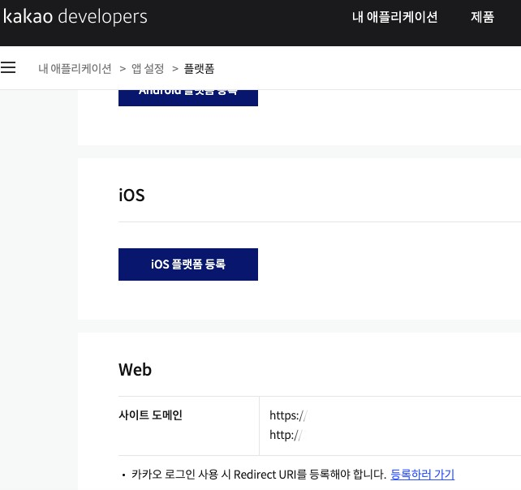

회사 사이트에 카카오 초대 링크 연동작업을 할 일이 생겼다. 
카카오 공식 연동안내 페이지에는 퓨어 javascript로,
다른 대부분 구글링에서는 react로 되어있어서 애를좀 먹었다.

우선 카카오 디밸로퍼스에서 url 등록을하고,(로컬작업시 로컬 url)

index.html 쪽에 cdn 코드를 넣어준다.
<link rel="stylesheet" href="//cdnjs.cloudflare.com/ajax/libs/highlight.js/9.12.0/styles/default.min.css">

 

<pre><code class="HTML"> 

&lt;script type="text/javascript" src="https://developers.kakao.com/sdk/js/kakao.min.js"&gt;&lt;/script&gt;
    &lt;script&gt;window.Kakao.init('고유 키');&lt;/script&gt;

</code></pre>
그후 main.ts 에서 글로벌 설정

<pre><code class="HTML"> 

declare global {
  interface Window {
    Kakao: any;
  }
}
</code></pre>

이후에 컴포넌트 쪽에서 함수를 따로 작성해주면된다.
<pre><code class="HTML"> 

function create_kakao_btn(){
  window.Kakao.Channel.createAddChannelButton({
  container: '#kakao-add-channel-button',
  channelPublicId: '' // 고유 id키
});
}
</code></pre>
